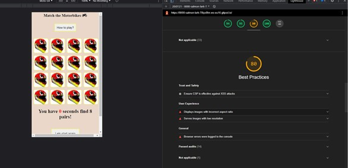
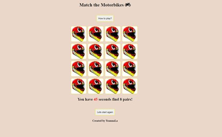

 # JavaScript Essentials - interactive front-end site.
## The deployed site can be find:
https://github.com/YoannaLa/BikeMemoryGame

Memory game, with the 16 cards that shuffles every time the player starts a game. The player has only 45 seconds of find the matching 8 motorbike cards.

# UX
## Website owner business goals
I have created a memory game using html, CSS and JavaScript. I've combined the love of simple memory game and motorbikes. I decided on hiding 8 pairs of motorbikes underneath 16 motorbike helmets. I gave a player 45 second to find the pairs. It is challenging, but I’ve successful won against the clock few times.

### User goals
#### New user goals
Memory game, with 8 pairs of cards, that shuffles every time the player starts a game. The player has only 45 seconds of find the matching 8 motorbike cards, if not a alert message will appear “times up”

#### Returning user goals
A returning player can challenge her/himself and test their memory and find out if is getting any better. 

### User stories
#### As a website owner
I've noticed a massive trend in last few years of memory or matching games being very popular and I'm a user myself. In creating this game I've combined the love of motorbikes and simple challenge 

#### New user 
A simple card game which helps to train memory and can be used as a challenge. 

#### Returning user goals
A returning player can test themselves if they memory got any better. 

### Structure of the website
The game is structured on a single page that includes the game name, pop out window explaining the rules of the game. There are 16 cards (squares) with 8 matching cards, which are faced down and the user can only see the identical faceup image which is a image of a helmet. The player has 45 seconds to match all 8 pairs or an alert with “times up” will come up. The player then can resume the game, the cards will be reshuffled, and the timer will start again. If the player beats the 45 second a congratulation message will appear when all cards matched.

### Wireframes
Initial draft of how the website should look like, I've changed few things as I've learn more about html and css and javascript

## Surface
### Colors
* Background color - rgb(221, 189, 166); which I made it lighter with adding 0.6 variable.
* Font color – #16181a;

## Features

### Technology
#### HTML
* As a structure language
#### CSS 
* As a style language 
#### JavaScript 
* As an interactive language
#### Font Awesome 
* Used for the icon of the bike 
#### Google fonts 
* As a font resource for the game
#### GitHub 
* As the hosting software platform to accommodate remote location 

4	Testing

    4.3	Functionality testing

### Compatibility testing
The game was tested and played across multiple virtual mobile devices and browsers. I checked all supported devices in Chrome developer tools.
I tested on hardware devices such as: iPhoneX, Samsung A70 and Microsoft Surface also
I've used this website to check responsives of my website (http://ami.responsivedesign.is/)

### Code Validation
  #### Jshint 
* Code Validation for JavaScript - I've updated the unsed variables
Metrics
There are 19 functions in this file.
Function with the largest signature take 1 arguments, while the median is 0.
Largest function has 10 statements in it, while the median is 2.
The most complex function has a cyclomatic complexity value of 4 while the median is 1.
15 warnings
1.	'const' is available in ES6 (use 'esversion: 6') or Mozilla JS extensions (use moz).
3.	'let' is available in ES6 (use 'esversion: 6') or Mozilla JS extensions (use moz).
4.	'let' is available in ES6 (use 'esversion: 6') or Mozilla JS extensions (use moz).
5.	'let' is available in ES6 (use 'esversion: 6') or Mozilla JS extensions (use moz).
32.	'let' is available in ES6 (use 'esversion: 6') or Mozilla JS extensions (use moz).
33.	Expected an assignment or function call and instead saw an expression.
48.	'arrow function syntax (=>)' is only available in ES6 (use 'esversion: 6').
57.	'destructuring assignment' is available in ES6 (use 'esversion: 6') or Mozilla JS extensions (use moz).
58.	'destructuring assignment' is available in ES6 (use 'esversion: 6') or Mozilla JS extensions (use moz).
66.	'arrow function syntax (=>)' is only available in ES6 (use 'esversion: 6').
67.	'let' is available in ES6 (use 'esversion: 6') or Mozilla JS extensions (use moz).
103.	'arrow function syntax (=>)' is only available in ES6 (use 'esversion: 6').
104.	'let' is available in ES6 (use 'esversion: 6') or Mozilla JS extensions (use moz).
110.	'arrow function syntax (=>)' is only available in ES6 (use 'esversion: 6').
135.	Unnecessary semicolon.

* Two unused variables - I've changed those in the file
1. 60	allMatch
2. 89	myButton  

#### W3C - hmtl
* 8 errors found as per image - I've corrected all of them 

I've corrected all of them and "Document checking completed. No errors or warnings to show"

#### W3C - CSS
* 2 errors found as per image 

** I've corrected the errors and run the code again and recived "Congratulations! No Error Found."

# User stories testing
## As a business owner: 
* I found matching the cards enjoyable and it fits well on different screens sizes.
## As a new customer: 
* Feedback from the other players was color contrast and font color which was ajusted.  
## As a returning customer:
The better color contrast helps with user experience and  
## Issues found during site development
* I found JavaScript extremely hard. I’ve been working on this for days, watching lots of youTube videos to get a better understanding. I’ve also took few days off work to complete this game. I realised I need more support; I need things to be explain to me face-to-face or in an environment I can asked question and share screen, etc., I feel like I have not been supported thou this course. 
Also what have made a massive difference in my confidence is that I've found out on Thursday, that I have failed my first assessment, which I was convinced I’ve passed. I’ve chatted to my mentor, and he shine some little on the feedback but the only think I could think that I will fail this one coz I don’t know what I’ve done wrong. I’ve asked for clarification on the feedback but have not receive anything in time. My mental health has suffered massively and once again not support from the anyone. I think I could produce much better submission if I been informed and had time to digest and get some prop clarification on what I’ve failed on. 

# Performance testing
* I run Lighthouse (https://developers.google.com/web/tools/lighthouse) tool to check performance of the website. I made one change and added missing meta-data discription to my html file and the overall preformance approved by 1%.Screenshots are presented below:

 

 

# Deployment
### This project was deployed on GitHub Pages. 
I used GitPod as a development environment where I committed all changes to git and push command to GitPod for the changes go be saved.

To deploy a project I had to:

Log in to GitHub and click on the right repository to deploy (BikeMemoryGame), I've 
selected "Settings" and found GitHub Pages section.("Pages settings now has its own dedicated tab! Check it out here!")
from source I've select branch to main and then saved the page so it could be deployed.
Your site is published at https://yoannala.github.io/BikeMemoryGame/

To run my project locally:

Log in to GitHub and click on the repository to download (BikeMemoryGame)
select Code icon to Download the ZIP file.
after download you can save the file and use it in your local environment
The other way is to Clone or/and Fork this repository (BikeMemoryGame) into your GitHub account.

# Credits
I have reached for help to my mentor and fellow students and couple of friends how are developers
Used those website: (https://www.w3schools.com/), (https://developer.mozilla.org/), (https://codepen.io/), (https://learn.codeinstitute.net/),

# Screenshots

